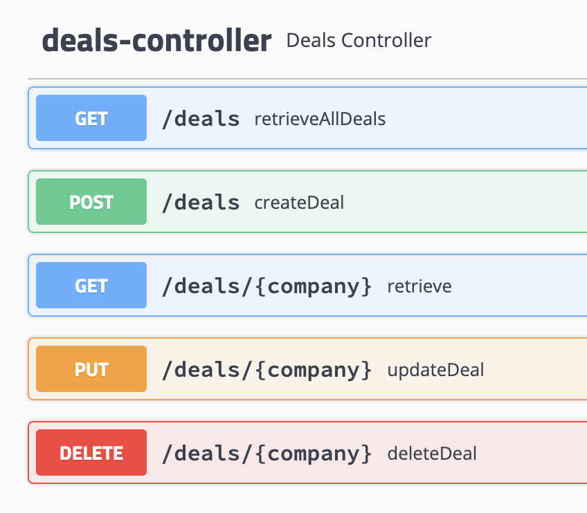
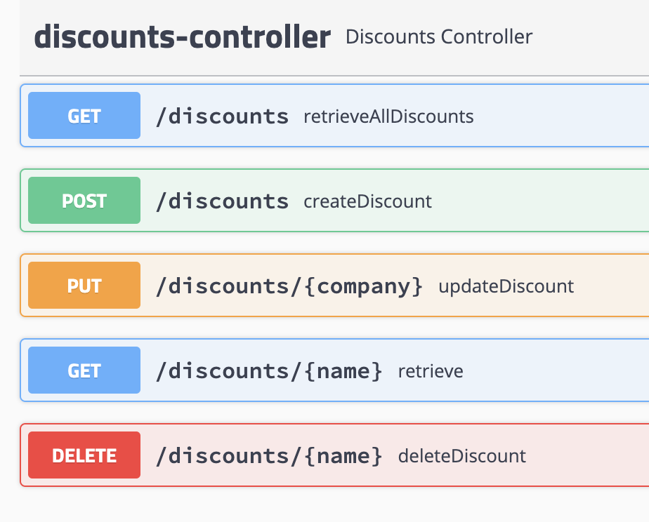
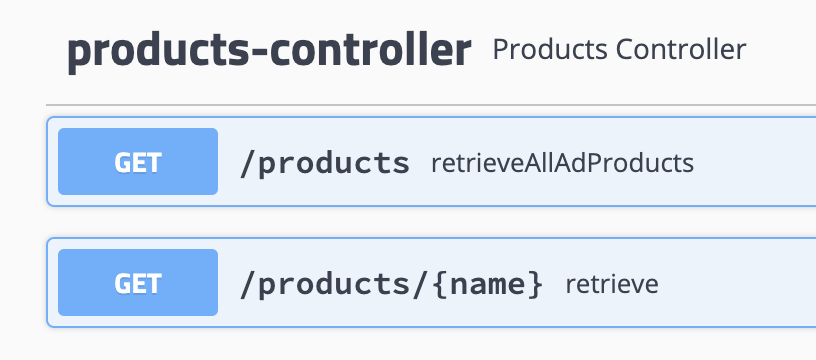
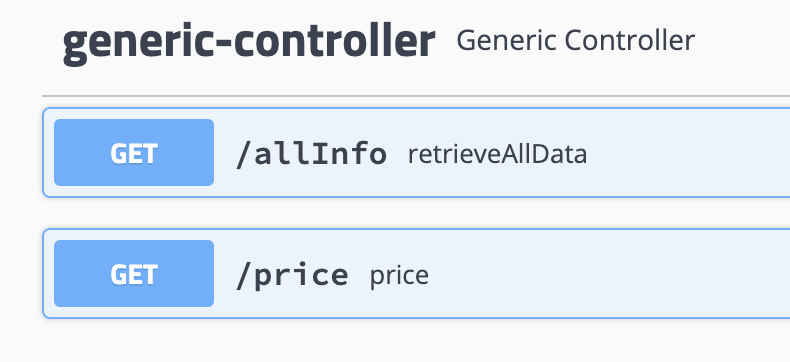

# Ads Products

## Assumptions
* Only the scenarios of Price calculation are tested 
* There are 3 tables used 
  1. Product - includes the ad tyes like Classic, Standard and Premium
  2. Deal - holds the deal prices like 3 for 2, 5 for 4 etc
  3. Discount - includes the discounted prices 
* company ID(number) would be the preferred way of implementation but for this demo the company name is used as the ID
* Log4j integration is pending but for this demo we could use ```System.out.println();```

## prerequisite
### Tech Used
* Java >8
* Maven
* Junit
* JaCoCo - Java code coverage tools (TBD)

### To build
* maven - ```mvn clean install```

### To run
* ```java -jar ads-app-1.0-SNAPSHOT.jar```

### CICD
* Jenkings or git (TBD)

### Sample curls
#### Swagger URL
`http://localhost:8080/swagger-ui.html`
#### Main Price Calculator API
``
curl --location --request GET 'http://localhost:8080/price' \
--header 'Content-Type: application/json' \
--data-raw '{
"customer": "axilCoffeeRoasters123",
"items": [
"std", "std","std", "premium"
]
}'
``

### Data file with SQL commands
* SQL queries file `src/main/resources/data.sql`
* Alternatively API can be used for inserting deleting and updating data
* Swagger file `http://localhost:8080/swagger-ui`

## Modifications via API 
### To Deals Data
`http://localhost:8080/swagger-ui.html#/deals-controller`



### To Discounts Data
`http://localhost:8080/swagger-ui.html#/discounts-controller`



### To view Products data
`http://localhost:8080/swagger-ui.html#/products-controller`



### to get _Price_ and all data
`http://localhost:8080/swagger-ui.html#/generic-controller`




